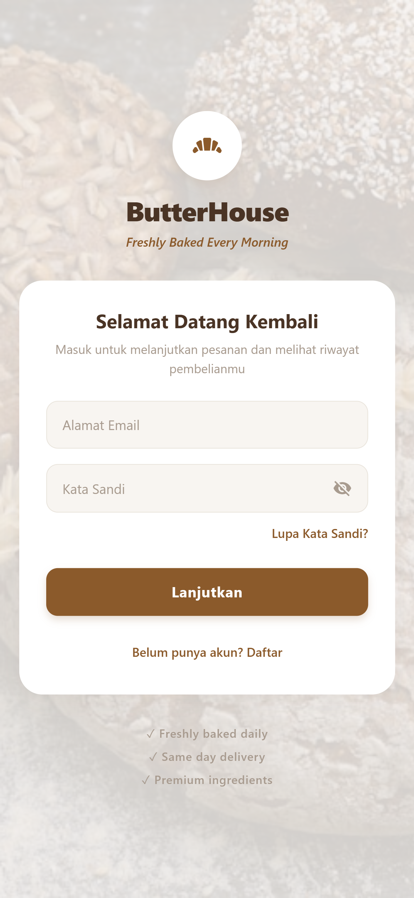
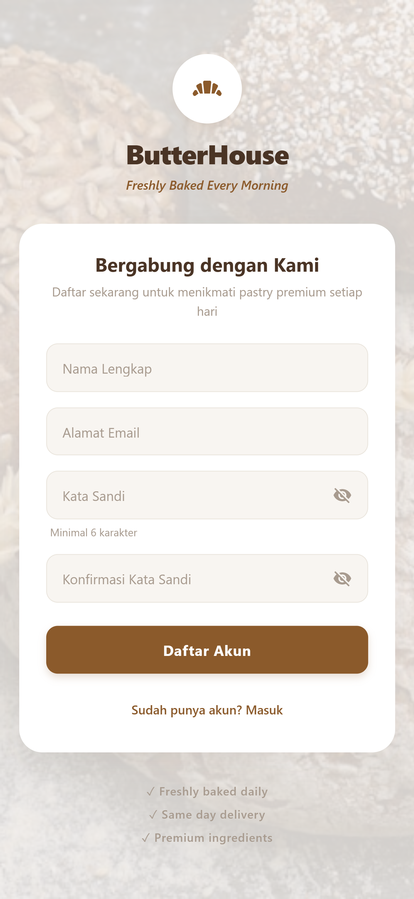
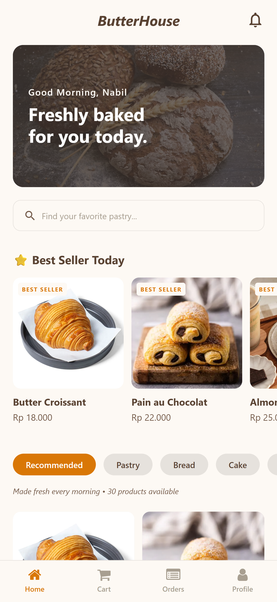
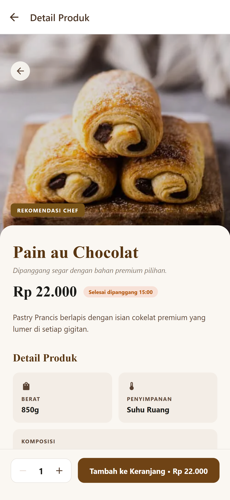
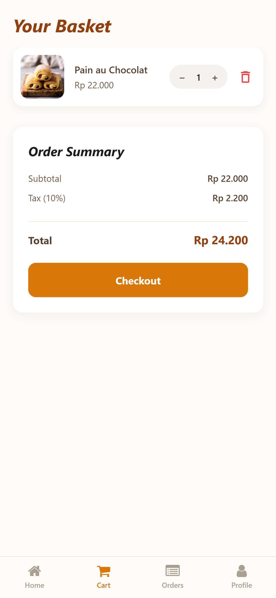
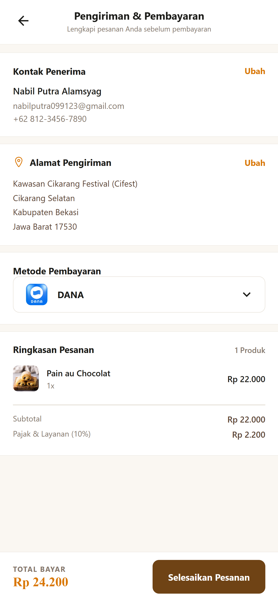
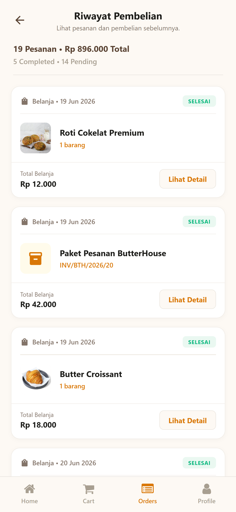
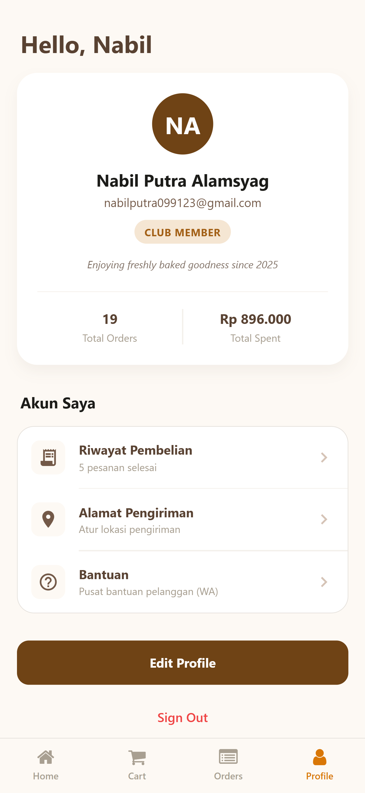

# 🥐 ButterHouse - Premium Bakery E-Commerce Mobile App
**Final Project Pemrograman Mobile & Interaksi Manusia Komputer (IMK)**

ButterHouse adalah aplikasi *e-commerce mobile* berkonsep *bakery/pastry* premium yang memungkinkan pengguna untuk menjelajahi katalog roti segar, menambahkan pesanan ke keranjang, mengelola alamat pengiriman, dan melakukan proses *checkout* dengan antarmuka yang elegan dan *user-friendly*.

---

## 👥 Kelompok 6 - Teknik Informatika (Universitas Pelita Bangsa)
Aplikasi ini dikembangkan dan dievaluasi oleh:
1. ADAM YUDA PRATAMA
2. BAGAS GIRI NUGRAHA
3. DAFA MAULANA MAKMUDIN
4. HAIDAR YUDHA PERDANA
5. NABIL PUTRA ALAMSYAH
6. RANGGA ARFIANSYAH AGESTI

---

## ✨ Fitur Utama
* **Autentikasi Aman:** Login dan Registrasi akun pengguna dengan validasi keamanan dan pop-up interaktif.
* **Katalog Produk:** Menampilkan daftar *pastry* premium dengan detail harga, deskripsi, dan komposisi yang informatif.
* **Manajemen Keranjang (Cart):** Pengguna dapat mengatur jumlah pesanan secara dinamis.
* **Proses Checkout Terpadu:** Pengguna dapat mengubah alamat, mengelola kontak penerima, dan memilih metode pembayaran langsung di dalam satu halaman *checkout* tanpa harus berpindah halaman.
* **Riwayat Pesanan:** Melacak pesanan aktif (Sedang Dikirim) dan riwayat belanja yang telah selesai lengkap dengan nomor *invoice*.

---

## 🎨 Implementasi Evaluasi UI/UX (Tugas IMK)
Berdasarkan hasil analisis dan evaluasi heuristik, kami telah menerapkan berbagai perbaikan antarmuka untuk meningkatkan kenyamanan pengguna:
1. **Perbaikan Copywriting:** Mengubah istilah teknis (seperti "Sign In Kelompok") menjadi bahasa yang lebih ramah pengguna ("Masuk ke ButterHouse").
2. **Konsistensi Visual:** Menyelaraskan palet warna (*earth tone/bakery*) pada seluruh tombol dan teks aplikasi.
3. **Peningkatan Form & Keamanan:** Menambahkan fitur *Show/Hide Password* dan input Konfirmasi Kata Sandi pada form registrasi.
4. **Optimalisasi Alur Checkout:** Mengubah fungsi tombol "Ubah" pada halaman *checkout* agar memunculkan *Modal/Pop-up* alih-alih melempar pengguna ke luar halaman, sehingga alur transaksi tidak terputus.
5. **Konsistensi Data:** Memastikan sinkronisasi nominal total belanja yang akurat antara daftar riwayat dan detail pesanan.

---

## 📸 Dokumentasi Layar (Screenshots)

<p align="center">
  
  
  
  
</p>
<p align="center">
  
  
  
  
</p>

---

## 🎥 Video Demo Aplikasi
Berikut adalah video demonstrasi alur penggunaan aplikasi ButterHouse dari awal hingga akhir:

👉 **[Tonton Video Demo di Sini](tempat link gdrive)**

*(Catatan: Harap pastikan menggunakan koneksi internet yang stabil untuk memutar video melalui Google Drive).*

---

## 🚀 Cara Menjalankan Project secara Lokal
Jika Anda ingin menjalankan *source code* ini di mesin lokal, ikuti langkah berikut:

1. Pastikan Anda telah menginstal Node.js dan Git.
2. Clone repositori ini:
```bash
   git clone <https://github.com/GitsBIL/butterhouse-app.git>
Masuk ke direktori proyek:

Bash
cd butterhouse-app
Instal dependensi:

Bash
npm install
Jalankan server lokal Expo:

Bash
npx expo start